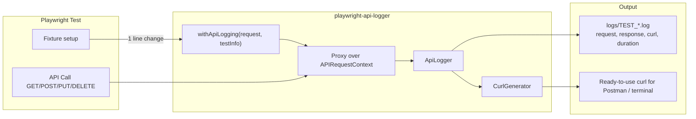

<p align="center">
  
</p>

<h1 align="center">playwright-api-logger</h1>

<p align="center">
  Comprehensive API request/response logger with curl export for Playwright tests
</p>

<p align="center">
  <a href="https://www.npmjs.com/package/playwright-api-logger"></a>
  <a href="https://www.npmjs.com/package/playwright-api-logger"></a>
  <a href="https://github.com/AZANIR/playwright-api-logger/blob/master/LICENSE"></a>
  <a href="https://playwright.dev/"></a>
  <a href="https://www.typescriptlang.org/"></a>
</p>

---

## How It Works



```
API_LOGS=true  → Logging ON   (files created in logs/)
API_LOGS=false → Logging OFF  (zero overhead, default)
```

## Features

- **One-line integration** — just wrap `request` with `withApiLogging()`, zero changes to controllers/clients
- **Structured logs** — one JSON document per test with `preconditions`, `steps`, and `teardown` sections
- **Step descriptions** — describe what each API call does with `.describe()`
- **Curl Export** — copy from log, paste into terminal or import into Postman
- **Env Control** — `API_LOGS=true/false` (default: `false`, zero overhead when off)
- **Token Masking** — Authorization headers are automatically masked
- **Form Data** — JSON, URL-encoded, and multipart/form-data support
- **Error Resilient** — logging never breaks your tests

## Installation

```bash
npm install playwright-api-logger
```

## Quick Start

### One line in your fixture — that's it!

```typescript
import { withApiLogging } from 'playwright-api-logger';

export const test = base.extend({
  apiClient: async ({ request }, use, testInfo) => {
    const loggedRequest = withApiLogging(request, testInfo);
    const apiClient = new ApiClient(loggedRequest);
    await use(apiClient);
    loggedRequest.__logger.finalize(
      testInfo.status === 'passed' ? 'PASSED' : 'FAILED'
    );
  },
});
```

No changes to your controllers, clients, or test files.

### With preconditions and step descriptions

```typescript
test('GET Without token (401)', async ({ apiClient, request }) => {
  const loggedRequest = (request as any).__logger as ApiLogger;

  // Mark following calls as preconditions
  loggedRequest.startPreconditions();
  loggedRequest.describe('Get employee ID for test');
  const employees = await apiClient.getEmployees({ page: 1, size: 1 });
  const employeeId = employees.items[0].id;

  // Switch to test steps
  loggedRequest.startTest();
  loggedRequest.describe('Get children without auth token');
  const response = await apiClient.getChildrenWithoutAuth(employeeId);
  expect(response.status).toBe(401);
});
```

### Enable via environment variable

```bash
# .env
API_LOGS=false
```

```bash
# Run with logging enabled
API_LOGS=true npx playwright test
```

## Log Output

One structured JSON document per test:

```
logs/
  get-without-token-401_2026-03-16T18-33-03.log
  create-employee_2026-03-16T18-35-10.log
```

### Example log:

```json
{
  "test": {
    "name": "GET Without token (401)",
    "file": "tests/api/employees/children.spec.ts",
    "startedAt": "2026-03-16T18:33:03.654Z",
    "finishedAt": "2026-03-16T18:33:04.300Z",
    "duration": 646,
    "result": "PASSED"
  },
  "preconditions": [
    {
      "step": 1,
      "description": "Get employee ID for test",
      "timestamp": "2026-03-16T18:33:04.174Z",
      "request": {
        "method": "GET",
        "url": "https://api.example.com/employees?page=1&size=1"
      },
      "response": {
        "status": 200,
        "body": { "items": [{ "id": "abc-123" }], "total": 27 }
      },
      "duration": 501,
      "curl": "curl -X GET 'https://api.example.com/employees?page=1&size=1' -H 'Accept: application/json'"
    }
  ],
  "steps": [
    {
      "step": 1,
      "description": "Get children without auth token",
      "timestamp": "2026-03-16T18:33:04.242Z",
      "request": {
        "method": "GET",
        "url": "https://api.example.com/employees/abc-123/children"
      },
      "response": {
        "status": 401,
        "body": { "detail": "Not authenticated" }
      },
      "duration": 67,
      "curl": "curl -X GET 'https://api.example.com/employees/abc-123/children'"
    }
  ],
  "teardown": [],
  "summary": {
    "totalRequests": 2,
    "preconditions": 1,
    "testSteps": 1,
    "teardown": 0,
    "totalDuration": 568
  }
}
```

## API Reference

### `withApiLogging(request, testInfoOrOptions?)` ⭐

Main integration point. Wraps `APIRequestContext` with a Proxy that logs all HTTP calls.

```typescript
const loggedRequest = withApiLogging(request, testInfo);
loggedRequest.__logger // access the ApiLogger instance
```

### `ApiLogger` — context & description

| Method | Description |
|--------|-------------|
| `describe(text)` | Set description for the **next** API call |
| `startPreconditions()` | Following calls → `preconditions` section |
| `startTest()` | Following calls → `steps` section |
| `startTeardown()` | Following calls → `teardown` section |
| `setContext(ctx)` | Set context directly (`'preconditions'` / `'test'` / `'teardown'`) |
| `finalize(result, info?)` | Write structured JSON document to file |
| `isEnabled()` | Check if logging is active |
| `getLogFilePath()` | Get current log file path |

### `CurlGenerator`

| Method | Description |
|--------|-------------|
| `CurlGenerator.generate(requestData, maskAuth?)` | Generate curl command string |

## Configuration

| Env Variable | Default | Description |
|-------------|---------|-------------|
| `API_LOGS` | `false` | Set to `'true'` to enable logging |

### `ApiLoggingOptions`

```typescript
{
  testName?: string;        // Test name (default: 'unknown-test')
  testFile?: string;        // Test file path
  context?: LogContext;      // 'preconditions' | 'test' | 'teardown'
  logDirectory?: string;     // Custom log dir (default: 'logs/')
  maskAuthTokens?: boolean;  // Mask auth headers (default: true)
  logger?: ApiLogger;        // Share logger across phases
}
```

## Migration from v1 → v2

```diff
- // v1: manual logger setup in controllers and clients
- const logger = createApiLogger(testInfo.title);
- apiClient.setApiLogger(logger);

+ // v2: one line, structured logs with sections
+ const loggedRequest = withApiLogging(request, testInfo);
+ const apiClient = new ApiClient(loggedRequest);
```

## License

MIT
