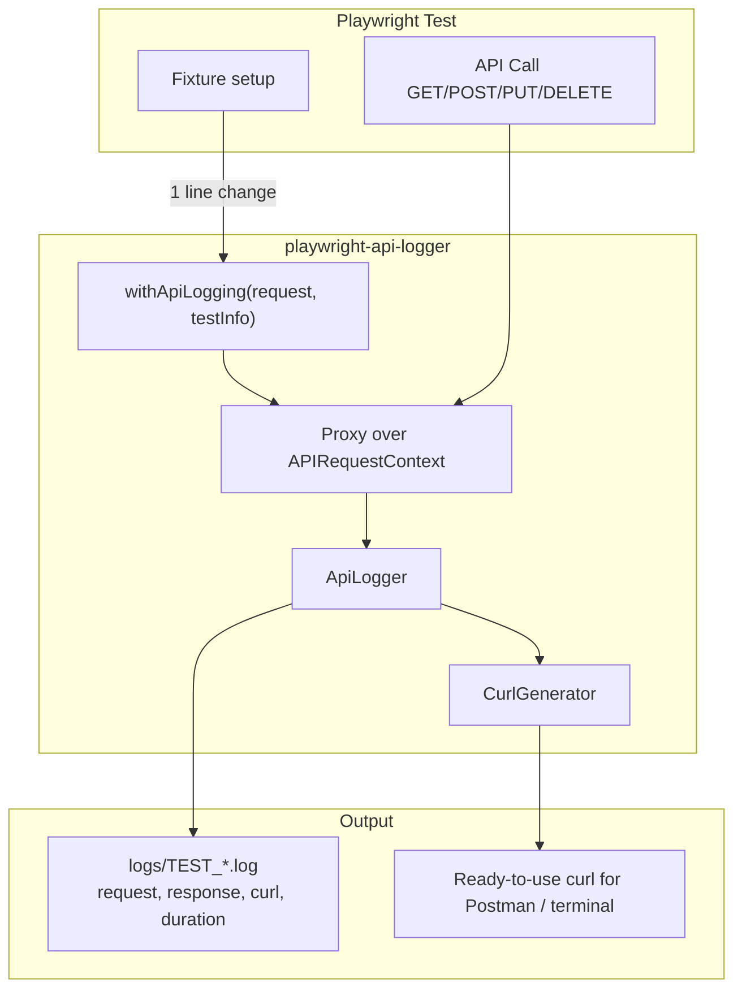

<p align="center">
  
</p>

<h1 align="center">playwright-api-logger</h1>

<p align="center">
  Comprehensive API request/response logger with curl export for Playwright tests
</p>

<p align="center">
  <a href="https://www.npmjs.com/package/playwright-api-logger"></a>
  <a href="https://www.npmjs.com/package/playwright-api-logger"></a>
  <a href="https://github.com/AZANIR/playwright-api-logger/blob/master/LICENSE"></a>
  <a href="https://playwright.dev/"></a>
  <a href="https://www.typescriptlang.org/"></a>
</p>

---

## How It Works



```
API_LOGS=true  → Logging ON   (files created in logs/)
API_LOGS=false → Logging OFF  (zero overhead, default)
```

## Features

- **One-line integration** — just wrap `request` with `withApiLogging()`, zero changes to controllers/clients
- **Full Logging** — method, URL, headers, request/response body, status, timing
- **Curl Export** — copy from log, paste into terminal or import into Postman
- **Env Control** — `API_LOGS=true/false` (default: `false`, zero overhead when off)
- **Context Tracking** — setup / test / teardown phases
- **Token Masking** — Authorization headers are automatically masked
- **Form Data** — JSON, URL-encoded, and multipart/form-data support
- **Error Resilient** — logging never breaks your tests

## Installation

```bash
npm install playwright-api-logger
```

## Quick Start

### One line in your fixture — that's it!

```typescript
import { withApiLogging } from 'playwright-api-logger';

export const test = base.extend({
  apiClient: async ({ request }, use, testInfo) => {
    // Just wrap request — all API calls are logged automatically
    const apiClient = new ApiClient(withApiLogging(request, testInfo));
    await use(apiClient);
  },
});
```

No changes to your controllers, clients, or test files.

### Enable via environment variable

```bash
# .env
API_LOGS=false
```

```bash
# Run with logging enabled
API_LOGS=true npx playwright test
```

### Finalize with test result (optional)

```typescript
apiClient: async ({ request }, use, testInfo) => {
  const loggedRequest = withApiLogging(request, testInfo);
  const apiClient = new ApiClient(loggedRequest);
  await use(apiClient);

  // Write PASSED/FAILED to log
  loggedRequest.__logger.finalize(
    testInfo.status === 'passed' ? 'PASSED' : 'FAILED'
  );
},
```

### Setup / Teardown logging

```typescript
// In beforeAll
const loggedRequest = withApiLogging(request, { testName: 'auth-setup', context: 'setup' });

// In afterAll
const loggedRequest = withApiLogging(request, { testName: 'cleanup', context: 'teardown' });
```

## Log Output

Logs are saved to `logs/` directory:

```
logs/
  TEST_my-test-name_2026-03-16T12-00-00.log
  SETUP_auth-setup_2026-03-16T12-00-00.log
  TEARDOWN_cleanup_2026-03-16T12-00-00.log
```

Each log entry is a JSON object:

```json
{
  "timestamp": "2026-03-16T12:00:00.000Z",
  "testName": "my-test-name",
  "context": "test",
  "request": {
    "method": "POST",
    "url": "https://api.example.com/users",
    "headers": { "Content-Type": "application/json" },
    "body": { "name": "John" }
  },
  "response": {
    "status": 201,
    "body": { "id": 1, "name": "John" }
  },
  "duration": 150,
  "curl": "curl -X POST 'https://api.example.com/users' -H 'Content-Type: application/json' --data '{\"name\":\"John\"}'"
}
```

## API Reference

### `withApiLogging(request, testInfoOrOptions?)` ⭐

Main integration point. Wraps `APIRequestContext` with a Proxy that logs all HTTP calls.

```typescript
// With TestInfo (recommended)
const loggedRequest = withApiLogging(request, testInfo);

// With options
const loggedRequest = withApiLogging(request, {
  testName: 'my-test',
  context: 'setup',
  logDirectory: 'custom-logs/',
  maskAuthTokens: true,
});

// Access logger for finalization
loggedRequest.__logger.finalize('PASSED');
```

### Factory Functions (advanced)

| Function | Description |
|----------|-------------|
| `createApiLogger(testName, context?)` | Create standalone logger |
| `createSetupLogger(testName)` | Logger with `'setup'` context |
| `createTeardownLogger(testName)` | Logger with `'teardown'` context |

### `CurlGenerator`

| Method | Description |
|--------|-------------|
| `CurlGenerator.generate(requestData, maskAuth?)` | Generate curl command string |

## Configuration

| Env Variable | Default | Description |
|-------------|---------|-------------|
| `API_LOGS` | `false` | Set to `'true'` to enable logging |

### `ApiLoggingOptions`

```typescript
{
  testName?: string;        // Test name (default: 'unknown-test')
  context?: LogContext;      // 'setup' | 'test' | 'teardown'
  logDirectory?: string;     // Custom log dir (default: 'logs/')
  maskAuthTokens?: boolean;  // Mask auth headers (default: true)
}
```

## Migration from v1

v1 required changes to controllers, clients, and fixtures. v2 needs only **one line**:

```diff
- const apiClient = new ApiClient(request);
+ const apiClient = new ApiClient(withApiLogging(request, testInfo));
```

## License

MIT
