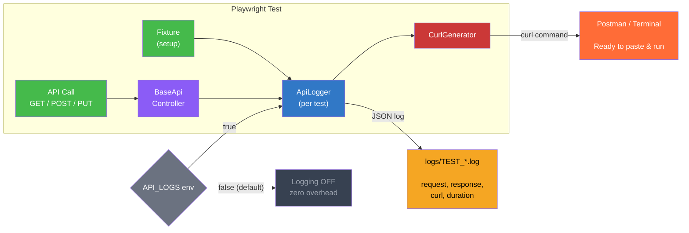

<p align="center">
  
</p>

<h1 align="center">playwright-api-logger</h1>

<p align="center">
  Comprehensive API request/response logger with curl export for Playwright tests
</p>

<p align="center">
  <a href="https://www.npmjs.com/package/playwright-api-logger"></a>
  <a href="https://www.npmjs.com/package/playwright-api-logger"></a>
  <a href="https://github.com/AZANIR/playwright-api-logger/blob/master/LICENSE"></a>
  <a href="https://playwright.dev/"></a>
  <a href="https://www.typescriptlang.org/"></a>
</p>

---

## How It Works



## Features

- **Full Logging** — method, URL, headers, request/response body, status, timing
- **Curl Export** — copy from log, paste into terminal or import into Postman
- **Env Control** — `API_LOGS=true/false` (default: `false`, zero overhead when off)
- **Context Tracking** — setup / test / teardown phases
- **Token Masking** — Authorization headers are automatically masked
- **Form Data** — JSON, URL-encoded, and multipart/form-data support
- **Error Resilient** — logging never breaks your tests

## Installation

```bash
npm install playwright-api-logger
```

## Quick Start

### Step 1. Add logger to your fixture

```typescript
import { createApiLogger } from 'playwright-api-logger';

export const test = base.extend({
  apiClient: async ({ request }, use, testInfo) => {
    const apiClient = new ApiClient(request);

    if (process.env.API_LOGS === 'true') {
      const logger = createApiLogger(testInfo.title, 'test');
      apiClient.setApiLogger(logger);
      await use(apiClient);
      logger.finalize(testInfo.status === 'passed' ? 'PASSED' : 'FAILED');
    } else {
      await use(apiClient);
    }
  },
});
```

### Step 2. Add logging to your base API controller

```typescript
import { ApiLogger } from 'playwright-api-logger';

class BaseApiController {
  protected apiLogger: ApiLogger | null = null;

  setApiLogger(logger: ApiLogger): void {
    this.apiLogger = logger;
  }

  async get(url: string, headers?: Record<string, string>) {
    const startTime = Date.now();
    const response = await this.request.get(url, { headers });
    const duration = Date.now() - startTime;

    if (this.apiLogger?.isEnabled()) {
      const body = await response.json().catch(() => response.text());
      this.apiLogger.logApiCall(
        'GET', url, headers, undefined,
        response.status(), undefined, body, duration
      );
    }

    return response;
  }
}
```

### Step 3. Enable via environment variable

```bash
# .env
API_LOGS=false
```

```bash
# Run with logging enabled
API_LOGS=true npx playwright test
```

## Log Output

Logs are saved to `logs/` directory:

```
logs/
  TEST_my-test-name_2026-03-16T12-00-00.log
  SETUP_auth-setup_2026-03-16T12-00-00.log
  TEARDOWN_cleanup_2026-03-16T12-00-00.log
```

Each log entry is a JSON object:

```json
{
  "timestamp": "2026-03-16T12:00:00.000Z",
  "testName": "my-test-name",
  "context": "test",
  "request": {
    "method": "POST",
    "url": "https://api.example.com/users",
    "headers": { "Content-Type": "application/json" },
    "body": { "name": "John" }
  },
  "response": {
    "status": 201,
    "body": { "id": 1, "name": "John" }
  },
  "duration": 150,
  "curl": "curl -X POST 'https://api.example.com/users' -H 'Content-Type: application/json' --data '{\"name\":\"John\"}'"
}
```

## API Reference

### Factory Functions

| Function | Description |
|----------|-------------|
| `createApiLogger(testName, context?)` | Create logger (context default: `'test'`) |
| `createSetupLogger(testName)` | Create logger with `'setup'` context |
| `createTeardownLogger(testName)` | Create logger with `'teardown'` context |

### `ApiLogger`

| Method | Description |
|--------|-------------|
| `logApiCall(method, url, reqHeaders, reqBody, status, resHeaders, resBody, duration)` | Log complete request + response |
| `logRequest(method, url, headers?, body?)` | Log request (pair with `logResponse`) |
| `logResponse(status, headers?, body?)` | Log response (pair with `logRequest`) |
| `isEnabled()` | Check if logging is active |
| `finalize(result, additionalInfo?)` | Write test result (`PASSED` / `FAILED` / `SKIPPED`) |
| `getLogFilePath()` | Get current log file path |

### `CurlGenerator`

| Method | Description |
|--------|-------------|
| `CurlGenerator.generate(requestData, maskAuth?)` | Generate curl command string |

## Configuration

| Env Variable | Default | Description |
|-------------|---------|-------------|
| `API_LOGS` | `false` | Set to `'true'` to enable logging |

```typescript
// LoggerConfig
{
  testName?: string;        // Test name (default: 'unknown-test')
  context?: LogContext;      // 'setup' | 'test' | 'teardown'
  logDirectory?: string;     // Custom log dir (default: 'logs/')
  maskAuthTokens?: boolean;  // Mask auth headers (default: true)
}
```

## License

MIT
